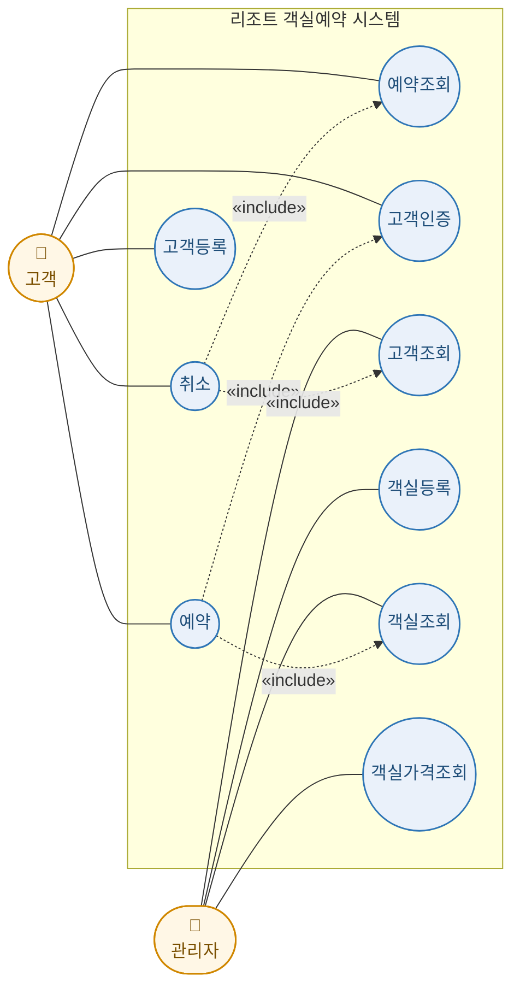

# 리조트 객실예약 시스템 유스케이스 다이어그램

## 시스템 개요

본 리조트 객실예약 시스템은 고객정보와 객실정보를 기반으로 예약, 취소, 조회 기능을 제공한다.
예약 시 반드시 고객인증과 객실조회를 거치며, 취소 시 반드시 예약조회와 고객조회를 거친다.

## 유스케이스 다이어그램 (graph LR)

## 액터 (Actor)

| 액터 | 설명 |
|------|------|
| 고객 (Customer) | 리조트 객실을 예약·취소·조회하는 사용자 |
| 관리자 (Admin) | 객실 정보를 등록·관리하고 고객 정보를 조회하는 사용자 |

## 유스케이스 목록

| 유스케이스 | 주체 | 비고 |
|------------|------|------|
| 예약 | 고객 | 고객인증, 객실조회를 include |
| 취소 | 고객 | 예약조회, 고객조회를 include |
| 예약조회 | 고객 | 예약id로 조회 |
| 고객등록 | 고객 | 신규 가입 |
| 고객인증 | 고객 | id / 암호 검증 |
| 고객조회 | 관리자 | id로 조회 |
| 객실등록 | 관리자 | 객실 정보 등록 |
| 객실조회 | 관리자 | 객실 정보 조회 |
| 객실가격조회 | 관리자 | 객실 가격 조회 |

## 주요 흐름

### 예약

1. 고객이 **예약** 유스케이스를 시작한다.
2. 시스템은 **고객인증** 을 수행한다 (`<<include>>`).
3. 시스템은 **객실조회** 를 수행한다 (`<<include>>`).
4. 숙박일자, 숙박기간을 입력 받는다.
5. 예약id 는 `id + 객실id + 숙박일자` 로 생성한다.
6. 총비용은 `객실가격 × 숙박기간` 으로 계산한다.
7. 예약 정보를 저장하고 총비용을 출력한다.

### 취소

1. 고객이 **취소** 유스케이스를 시작한다.
2. 시스템은 **예약조회** 를 수행한다 (`<<include>>`, 예약id 로 조회).
3. 시스템은 **고객조회** 를 수행한다 (`<<include>>`).
4. 해당 예약을 취소 처리한다.
